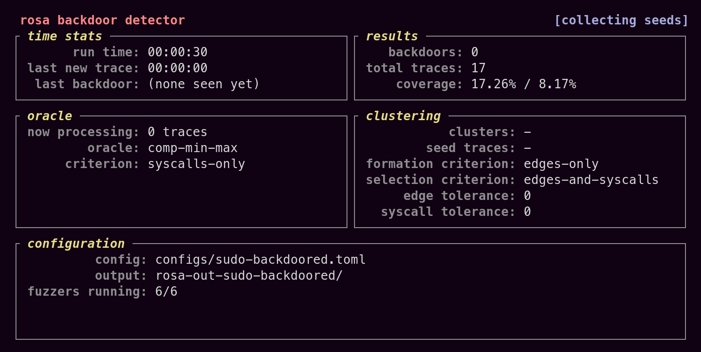

# ROSA


[ROSA](https://genius.com/Marty-robbins-el-paso-lyrics#:~:text=the%20back%20door%20of%20Rosa%27s)
(a.k.a.  _**R**untime trace **O**racle-based **S**election **A**lgorithm for backdoor detection_)
is a prototype made to evaluate a fuzzing-based backdoor detection method.


## Installation

In order to install ROSA, you must build it from source. To do that, you need the following
dependencies:

- The Rust toolchain (preferably via [rustup](https://rustup.rs/))
- [mdbook](https://github.com/rust-lang/mdBook) (to build the detailed documentation)

**NOTE: ROSA is currently only supported on Linux x86_64 systems. It most definitely depends on
libc, so it might not work out of the box (or at all) in other systems.**

You can then install ROSA with Cargo:
```console
$ cargo install --git https://github.com/icse25-938/rosa
```

Or locally provided you clone this repo:
```console
$ cargo install --path /path/to/rosa/clone
```


## Using ROSA

### Choosing a fuzzer

In order to use ROSA, you need a fuzzer to use as a backend. The recommended approach is to use
[AFL++](https://github.com/AFLplusplus/AFLplusplus). In `fuzzers/aflpp`, you will find a
pre-selected version of AFL++ (provided as a submodule) and two patches to apply to it to make it
compatible with ROSA.

The patches can be applied in the following way:
```console
$ cd fuzzers/aflpp/aflpp/
$ git submodule update --init
$ patch -p1 < ../aflpp-rosa.patch
$ cd qemu_mode/qemuafl/
$ patch -p1 < ../../../qemuafl-rosa.patch
```

Be aware that the version of AFL++ used will do a fresh clone of QEMU-AFL and overwrite the second
patch by default, so you should modify the build script to avoid that in order to build with the
ROSA patch.


### Running ROSA


#### Fetching a backdoored target program

Once you have installed AFL++, you can test ROSA out on a backdoored version of the Unix utility
_sudo_, found on <https://github.com/icse25-938/rosarum>. You can clone the repo and build the
backdoored version of sudo like this:

```console
$ git clone https://github.com/icse25-938/rosarum
$ cd rosarum/synthetic/sudo-1.9.15p5
$ make ground-truth
```

You can verify that it has been built successfully by providing the password `"let_me_in"` (the
backdoor trigger) to the ground-truth version, which should print an appropriate message signaling
that the backdoor has been triggered:

```console
$ echo "let_me_in" | ./ground-truth/build/bin/sudo -Sk -- id
Password: ***BACKDOOR TRIGGERED***
uid=0(root) gid=0(root) groups=0(root)
```

#### Detecting the backdoor with ROSA

You can adapt the paths in the configuration file `examples/configs/sudo-backdoored.toml` to match
your locally built versions of AFL++ and sudo. You can do a quick find-and-replace of 
`/path/to/aflpp` with the path to the AFL++ clone and `/path/to/sudo` with the path to the
backdoored sudo binary.

Once the configuration file is ready, you can run ROSA with the following command:
```console
$ rosa -c examples/configs/sudo-backdoored.toml -v
```

ROSA should now be running:

 

After some time, ROSA should detect the backdoor. An input triggering the backdoor will then be
stored under `rosa-out-sudo-backdoored/backdoors`.


#### Detecting other backdoors

In order to run a detection campaign on a different target binary, you can adapt the configuration
file accordingly. If you wish, you can fine-tune the parameters of the fuzzers (such as the seeds
or the dictionaries used, see [AFL++'s documentation](https://aflplus.plus/docs/)).


## Documentation

You can build and preview the full documentation with `mdbook`:
```console
$ mdbook serve doc
```

You can also build and preview the API documentation with `cargo doc`:
```console
$ cargo doc --open
```
