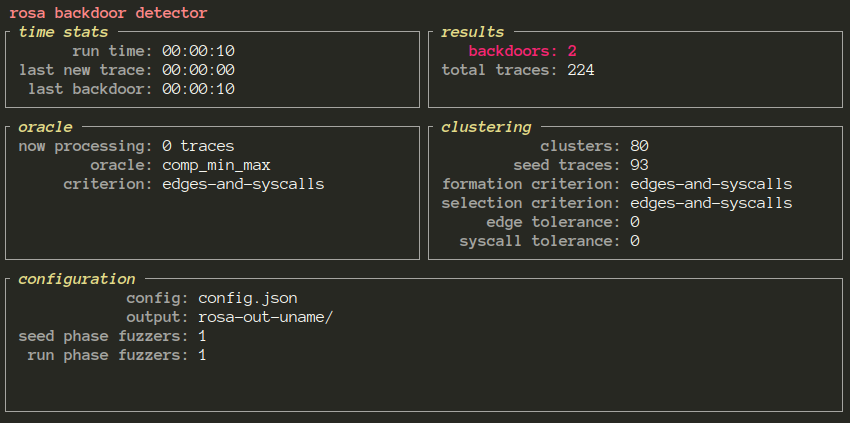

# Quickstart

## Choosing a fuzzer

ROSA is a _fuzzer-based_ backdoor detector, so you need a fuzzer that's able to talk to ROSA's API.
Currently, the only supported fuzzer is [a modified version of AFL++](TODO link); the rest of this
guide assumes you've installed it and are ready to use it.

In theory, other fuzzers can be used in its place; see [Using other
fuzzers](./extensions_fuzzers.md) to learn more about that.


## Choosing a target program

You need to choose a **target program** to analyze for backdoors; for this example, we will use a
backdoored version of the widely used
[coreutils](https://www.gnu.org/software/coreutils/coreutils.html) program `uname`. This backdoored
`uname` allows the user to run a bash shell when the flags `-b` or `--bckdr` are passed to it; this
could be a security threat if some user-facing privileged program were to call this backdoored
uname to get some information (and might thus accidentally expose a root shell to the user). The
code of this backdoored `uname` can be found on <TODO link>.


## Setting up ROSA

Before launching the backdoor detection campaign, we need to set up the configuration of ROSA we're
planning on using, as well as some basic test inputs (seeds) for the fuzzer.

We will create the seeds first by providing a single, basic example of a `uname` invocation:
```console
$ mkdir seeds/
$ echo -en "uname\x00-r" > seeds/example
```

We now need to create ROSA's configuration. We will stick to a very basic configuration with a lot
of default setttings; for a more in-depth guide, see [Configuration
guide](./configuration_guide.md).

Create a file named `config.json` with the following content:
```json
{
    "output_dir": "rosa-out-uname",
    "seed_phase_fuzzers": [
        {
            "name": "main",
            "cmd": [
                "afl-fuzz",
                "-i",
                "seeds/",
                "-o",
                "fuzzer-out-uname",
                "-r",
                "-V",
                "2",
                "-Q",
                "-c",
                "0",
                "--",
                "./backdoored-coreutils/src/uname"
            ],
            "env": {
                "AFL_COMPCOV_LEVEL": "2",
                "AFL_PRELOAD": "<aflpp dir>/utils/argv_fuzzing/argvfuzz64.so:<aflpp dir>/libcompcov.so"
            },
            "test_input_dir": "fuzzer-out-uname/default/queue",
            "trace_dump_dir": "fuzzer-out-uname/default/trace_dumps",
            "crashes_dir": "fuzzer-out-uname/default/crashes"
        }
    ],
    "run_phase_fuzzers": [
        {
            "name": "main",
            "cmd": [
                "afl-fuzz",
                "-i",
                "-",
                "-o",
                "fuzzer-out-uname",
                "-r",
                "-Q",
                "-c",
                "0",
                "--",
                "./backdoored-coreutils/src/uname"
            ],
            "env": {
                "AFL_COMPCOV_LEVEL": "2",
                "AFL_PRELOAD": "<aflpp dir>/utils/argv_fuzzing/argvfuzz64.so:<aflpp dir>/libcompcov.so"
            },
            "test_input_dir": "fuzzer-out-uname/default/queue",
            "trace_dump_dir": "fuzzer-out-uname/default/trace_dumps",
            "crashes_dir": "fuzzer-out-uname/default/crashes"
        }
    ]
}
```

A quick breakdown of the configuration file:
- We want all of the output/findings of ROSA to go in `rosa-out-uname/`
- For the _seed phase_ of the detection, we want a single instance of AFL++ to run for 2 seconds
  (`-V 2`)
- For the _run phase_ of the detection, we also want a single instance of AFL++ (no time limit, of
  course)
- In both cases, we want the fuzzer to run with some extra plugins to help uncover "magic bytes"
  (i.e. the strings `-b` and `--bckdr` triggering the backdoors)

## Running ROSA

We are now ready to run ROSA:
```console
$ rosa -v
[rosa]  Collecting seed traces...
[rosa]  Fuzzer seed processes:
[rosa]    Fuzzer process:
[rosa]      Env: AFL_COMPCOV_LEVEL=2 AFL_PRELOAD=/aflpp/utils/argv_fuzzing/argvfuzz64.so:/aflpp/libcompcov.so
[rosa]      Cmd: afl-fuzz -i seeds/ -o fuzzer-out-uname -r -V 2 -Q -c 0 -- ./backdoored-coreutils/src/uname
[rosa]  Collected 94 seed traces.
[rosa]  Clustering seed traces...
[rosa]  Created 75 clusters.
[rosa]  Starting backdoor detection...
[rosa]  Fuzzer run processes:
[rosa]    Fuzzer process:
[rosa]      Env: AFL_COMPCOV_LEVEL=2 AFL_PRELOAD=/aflpp/utils/argv_fuzzing/argvfuzz64.so:/aflpp/libcompcov.so
[rosa]      Cmd: afl-fuzz -i - -o fuzzer-out-uname -r -Q -c 0 -- ./backdoored-coreutils/src/uname
```

You should then see the backdoor detection screen:



You can stop the backdoor detection at any time by hitting `Ctrl-C`.


## Analyzing the backdoors

The backdoors are found in `rosa-out-uname/backdoors`. We can examine them with `hexdump`, for
example:
```console
$ hexdump -C rosa-out-uname/backdoors/main__id_000145                                                                       ⊤
00000000  76 46 46 78 73 73 78 62  00 2d 6f 62 00 2d 6f     |vFFxssxb.-ob.-o|
0000000f
```

If we run `uname` with this input through a debugger, we can see how it leads to opening a shell
because of the `-b` option, and we can thus pinpoint the exact position of the backdoor in the
source code.
